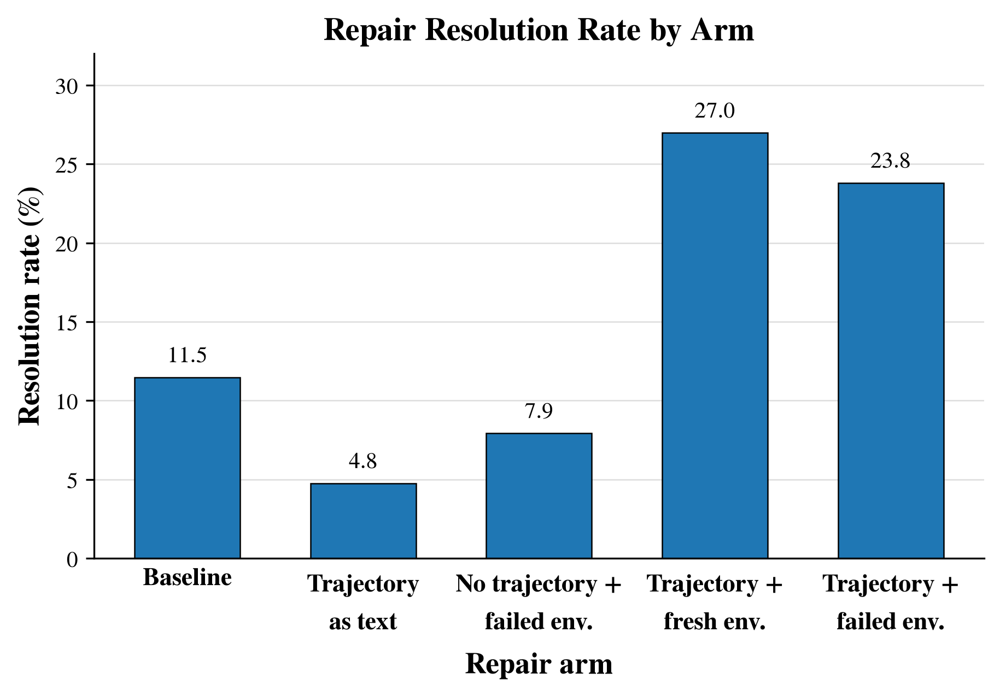
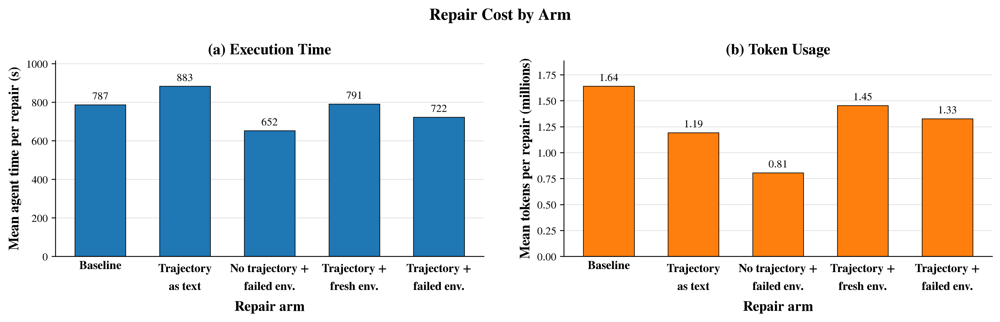
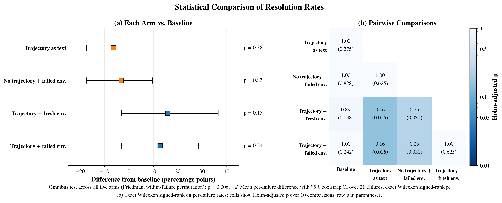

# What helps a retry? Findings of repair round 1, all five arms (2026-10-09)

The owner's reading of repair round 1 (ADR-0012, `tb40-repair-v2`) for the Oct 9 demo, with its figures.
Same model (Sonnet 5.5), same 21 failed TB 4.0 attempts, five kinds of context, 3 repairs each.
Unlike the round's research notes, this document interprets; the facts it rests on are in
`docs/research/2026-10-03_tb40-repair-v2-round1.md` (the four round 1 arms) and
`docs/research/2026-10-08_tb40-repair-v2-traj-text.md` (the fifth arm, `traj-text`).

## Arms

| Figure label | Arm | Container the repair starts in | History of the failed attempt |
|---|---|---|---|
| Baseline | `fresh` | task image | none |
| Trajectory as text | `traj-text` | task image | a plain-text transcript in the prompt, rendered from the ATIF trajectory, long outputs cut |
| No trajectory + failed env. | `state` | failed attempt's final checkpoint | none |
| Trajectory + fresh env. | `traj` | task image | the failed attempt's native Claude Code session, resumed (`claude --resume`) |
| Trajectory + failed env. | `state-traj` | failed attempt's final checkpoint | the native session, resumed |

## Figures

Regenerate with
`uv run --script scripts/2026-10-09_repair_figures.py corpus/jobs/tb40-sonnet-v2 --out docs/research/figures/2026-10-09_repair-round1`
(PNG and PDF; the bootstrap and permutation use a fixed seed).

**Figure 1.** Repair resolution rate by arm, pooled over each arm's repairs with a reward (Baseline 7 of 61, leaving out 2 infra errors; every other arm out of 63).

**Figure 2.** Repair cost by arm: (a) mean agent time per repair; (b) mean tokens per repair, the repair's own API calls only (input, cache writes, cache reads, output; cache reads are most of it).

**Figure 3.** Statistical comparison of resolution rates: (a) each arm against Baseline, the mean per-failure difference with a 95% bootstrap interval over failures and the exact Wilcoxon signed-rank p (ADR-0012's primary test); (b) all ten pairs, Holm-adjusted p with raw p in parentheses. The footnote gives the omnibus test.

## Findings

**Main finding.** A repair agent that resumes its own failed session resolves the most failures (27.0% with a fresh environment, 23.8% with the failed one), and one given the same history as a plain-text transcript resolves the fewest (4.8%, against an 11.5% baseline); the arms differ overall (p ≈ 0.006), but no single pair survives correction.

**Visual evidence.**
- Figure 1: the two trajectory-resuming bars stand at about twice the baseline; the text-transcript bar sits below it.
- Figure 3(a): both trajectory-resuming arms lie right of zero, the text arm left of it.
- Figure 3(b): the darkest cells are the trajectory-resuming arms against the text arm (raw p = 0.016; 7 failures better, 0 worse).
- Per failure (the traj-text note's per-failure table): 11 of the 21 failures were repaired by no arm, so every comparison rests on the other 10.

**Surprises, caveats, and a failed assumption.**
- Failed assumption: the text transcript carries the same attempt, so it was expected to land between Baseline and the resumed session; it fell below Baseline.
  The resumed session differs from it in three ways this design cannot separate: the agent's own reasoning, untruncated tool output, and the history arriving as its own conversation rather than as a document (ADR-0012, `traj-text` amendment).
- Surprise: the failed environment alone did not help (7.9%), and adding it to the resumed session added nothing (23.8% vs 27.0%). Checkpoints are filesystem-only, so anything the failed attempt left running is gone.
- Observed: 5 text-transcript repairs began by editing files from the failed attempt that do not exist in the fresh container (`docs/research/2026-10-08_tb40-repair-v2-traj-text-early-stop.md`).
- Caveats: 21 failures, one per task. The text arm ran five days after the others. Baseline lost 2 repairs to infra errors and 3 to safety refusals. Resolution rate is a proxy for finding the error, not a measure of it. Time and token cost are similar across arms, and their means are skewed by one long task (layout-config-recreation).

**Effect on the project's claim.**
- Strengthens: a recorded run carries signal a fresh retry lacks, but only in its native, full form.
- Weakens: the environment snapshot alone does not help a repair agent.
- Changes: the claim becomes one about the fidelity of the record. A lossy text rendering can be worse than no history.

**Next experiment.** Error localization with verified ground truth (ADR-0013): replay the verifier on recorded checkpoints to find the tool call that broke the task, then ask an LLM analyst to locate it with and without the checkpoint record, plus a small human timing check.
It resolves whether the record helps someone find an error, which repair rate cannot answer because it mixes finding the error with the model's ability to fix it.

## Why the pairwise tests do not survive correction

A paired test learns only from failures where two arms differ: 4 to 8 per pair here, after the 11 failures no arm repaired and the ties drop out.
With 7 such failures all in one direction, the exact test's smallest possible p is 2/2⁷ = 0.016, and Holm over ten comparisons multiplies it by 10.
Passing 0.05 after correction needs a raw p below 0.005, that is, at least 9 informative failures all in one direction.
The omnibus test uses all 10 informative failures and all five arms in one test, where the same ordering repeats from failure to failure, and pays no correction.
More distinct failed tasks, not more repairs per failure, would tighten the pairwise comparisons.
